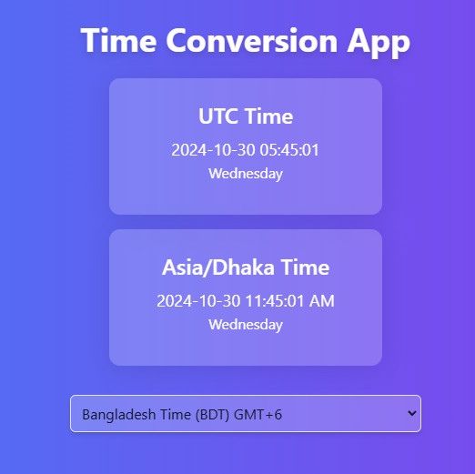

# Time Conversion App

A React-based Time Conversion App that displays the current UTC time and date, along with the ability to view the time in various time zones like Bangladesh Time (BDT), Eastern Standard Time (EST), and more. The app is styled with Tailwind CSS for a modern, responsive design.

## Features

- **Current UTC Time Display**: Shows the real-time UTC date and time.
- **Timezone Conversion**: Convert UTC time to different time zones such as BDT, EST, PST, and more.
- **Day and AM/PM Display**: Displays the day and time format (AM/PM) for each timezone.
- **Timezone Offset**: Each timezone in the dropdown includes the offset from UTC.

## Preview



## Getting Started

Follow these instructions to set up the project locally.

### Prerequisites

- Node.js and npm installed
- Git for version control

### Installation

1. **Clone the repository:**

   ```bash
   git clone https://github.com/TanvirJahan001/Time-Conversion-App.git
   cd Time-Conversion-App
   ```

2. **Install dependencies:**

   ```bash
   npm install
   ```

3. **Run the application:**

   ```bash
   npm start
   ```

4. **Open in Browser:**

   The app will run at `http://localhost:3000` by default.

### Code Snippet

Here’s the core code of the app:

```javascript
import { formatInTimeZone } from "date-fns-tz";
import React, { useEffect, useState } from "react";
import "./index.css";

const TimeApp = () => {
  const [utcTime, setUtcTime] = useState(new Date());
  const [timezone, setTimezone] = useState("Asia/Dhaka");

  useEffect(() => {
    const timer = setInterval(() => setUtcTime(new Date()), 1000);
    return () => clearInterval(timer);
  }, []);

  const formattedUTCTime = utcTime
    .toISOString()
    .substring(0, 19)
    .replace("T", " ");
  const formattedUTCDay = utcTime.toLocaleDateString("en-US", {
    weekday: "long",
    timeZone: "UTC",
  });
  const formattedLocalTime = formatInTimeZone(
    utcTime,
    timezone,
    "yyyy-MM-dd hh:mm:ss a"
  );
  const formattedLocalDay = formatInTimeZone(utcTime, timezone, "EEEE");

  return (
    <div className="flex flex-col items-center justify-center min-h-screen bg-gradient-to-r from-blue-500 to-purple-600 text-white">
      <h1 className="text-4xl font-bold mb-6 drop-shadow-lg">
        Time Conversion App
      </h1>
      <div className="card text-center p-4 mb-4 bg-white bg-opacity-20 rounded-md shadow-lg backdrop-blur-md">
        <h2 className="text-2xl font-semibold mb-2">UTC Time</h2>
        <p className="text-lg">{formattedUTCTime}</p>
        <p className="text-md">{formattedUTCDay}</p>
      </div>
      <div className="card text-center p-4 mb-4 bg-white bg-opacity-20 rounded-md shadow-lg backdrop-blur-md">
        <h2 className="text-2xl font-semibold mb-2">{timezone} Time</h2>
        <p className="text-lg">{formattedLocalTime}</p>
        <p className="text-md">{formattedLocalDay}</p>
      </div>
      <select
        className="p-2 border rounded-md bg-white bg-opacity-20 backdrop-blur-md shadow-md text-gray-900 mt-4 transition-transform duration-500 ease-in-out"
        value={timezone}
        onChange={(e) => setTimezone(e.target.value)}
      >
        <option value="UTC">Coordinated Universal Time (UTC)</option>
        <option value="Europe/London">
          Greenwich Mean Time (GMT) {getUTCOffset("Europe/London")}
        </option>
        <option value="America/Los_Angeles">
          Pacific Standard Time (PST) {getUTCOffset("America/Los_Angeles")}
        </option>
        <option value="America/New_York">
          Eastern Standard Time (EST) {getUTCOffset("America/New_York")}
        </option>
        <option value="Asia/Shanghai">
          China Standard Time (CST) {getUTCOffset("Asia/Shanghai")}
        </option>
        <option value="Asia/Dhaka">
          Bangladesh Time (BDT) {getUTCOffset("Asia/Dhaka")}
        </option>
        <option value="Asia/Kolkata">
          India Standard Time (IST) {getUTCOffset("Asia/Kolkata")}
        </option>
        <option value="Asia/Tokyo">
          Japan Standard Time (JST) {getUTCOffset("Asia/Tokyo")}
        </option>
        <option value="Australia/Sydney">
          Australian Eastern Daylight Time (AEDT){" "}
          {getUTCOffset("Australia/Sydney")}
        </option>
      </select>
    </div>
  );
};

export default TimeApp;
```
